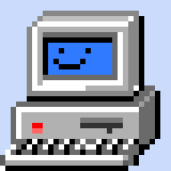

---
#
# By default, content added below the "---" mark will appear in the home page
# between the top bar and the list of recent posts.
# To change the home page layout, edit the _layouts/home.html file.
# See: https://jekyllrb.com/docs/themes/#overriding-theme-defaults
#
layout: home
title: Home
---

  

👋 Hey, welcome !
This is my homepage !
* Follow me on [GitHub](https://github.com/jojobrain)

  

    
  

